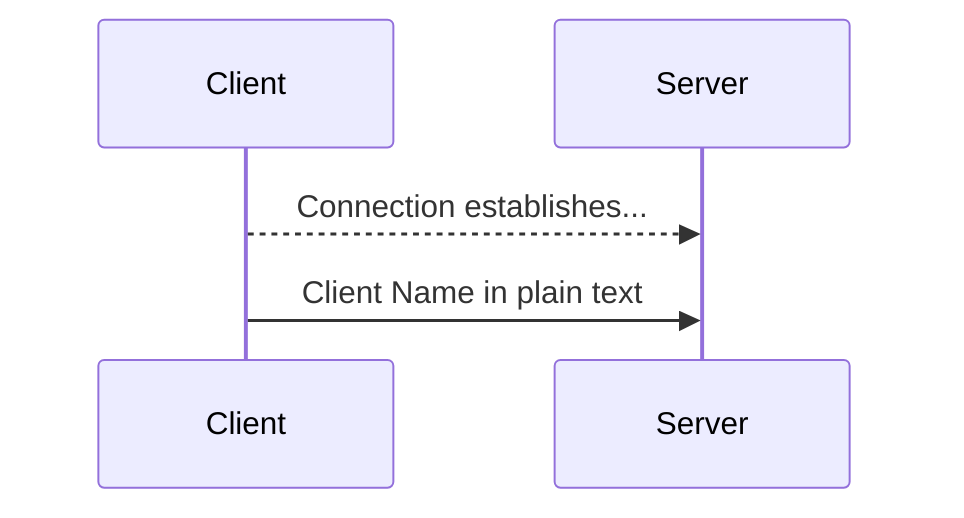
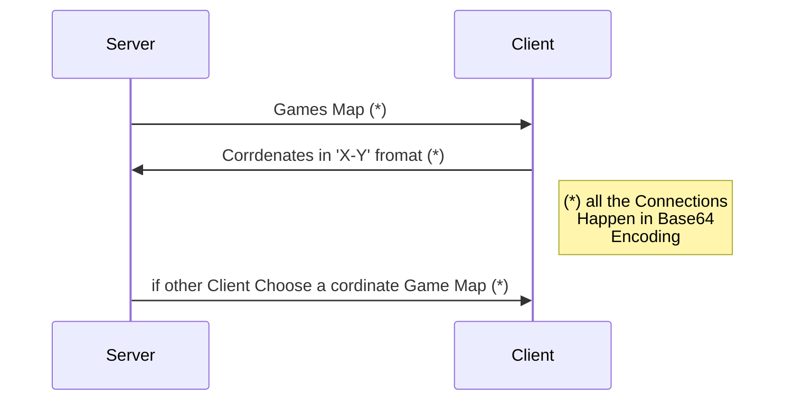

  

  

# Node Restful API wrapper

  

> a small package lets you interact with java server Via restful endpoints

  

  

you can use this package to run server then add your codes to interact with the java server of Data Structure Class Project available in [here](https://github.com/AshkanAbd/khat_noghte_rebuild)

  

  

## Installation

  

  

OS X & Linux & Windows:

  

  

```sh

  

npm install

  

npm run

  

```

  

>it will startup an instance of server as well so no need to run it sepreted

  

  

>but its recommended to read the API docs and understand how server works

  

  

## API
  

    localhost:3000/{Name}
as GET and will assign your bot to the server

    localhost:3000/{Name}/{coordinates}

as GET send the coordinates of your desire to chose the line to fill with your name
>the coordinates format must be X-Y

    localhost:3000/MAP/{Name}

as Get it will give you the last map you need to choose on
 
  

# Connection Diagrams

  

  

### Connection Establishment Phase

  



[if the above is bot compiled](https://mermaidjs.github.io/mermaid-live-editor/#/view/eyJjb2RlIjoic2VxdWVuY2VEaWFncmFtXG5DbGllbnQgLS0-PiBTZXJ2ZXI6IENvbm5lY3Rpb24gZXN0YWJsaXNoZXMuLi5cbkNsaWVudCAtPj4gU2VydmVyOiBDbGllbnQgTmFtZSBpbiBwbGFpbiB0ZXh0ICIsIm1lcm1haWQiOnsidGhlbWUiOiJkZWZhdWx0In19)

  

### After Connection Established

  



[link to diagram if not compiled](https://mermaidjs.github.io/mermaid-live-editor/#/view/eyJjb2RlIjoic2VxdWVuY2VEaWFncmFtXG5TZXJ2ZXItPj4gQ2xpZW50OkdhbWVzIE1hcCAoKilcbkNsaWVudCAtPj4gU2VydmVyOkNvcnJkZW5hdGVzIGluICdYLVknIGZyb21hdCAoKilcbk5vdGUgcmlnaHQgb2YgQ2xpZW50OigqKSBhbGwgdGhlIENvbm5lY3Rpb25zPGJyPiBIYXBwZW4gaW4gQmFzZTY0PGJyPiBFbmNvZGluZ1xuU2VydmVyIC0-PiBDbGllbnQ6IGlmIG90aGVyIENsaWVudCBDaG9vc2UgYSBjb3JkaW5hdGUgR2FtZSBNYXAgKCopXG4iLCJtZXJtYWlkIjp7InRoZW1lIjoiZGVmYXVsdCJ9fQ)

  

## Map

 

    2-1
    0-0
    @-@A@-@-@
    -#-#-#-#-
    @-@-@-@-@
    -#-#-#-#-
    @-@-@-@-@
    -#-#-#-#-
    @-@-@-@-@
    -#-#B#-#-
    @-@-@-@-@

2-1 ==> 2:your Id , 1:opponent Id

0-0 ==> Results so far

| Symbol | Meaning |
|--|--|
| A | Client with the id 1 |
| B | Client with the Id 2 |
| @ | Nodes |
| # | Blocks as Points |
| - | the Line Can be Chosen |
