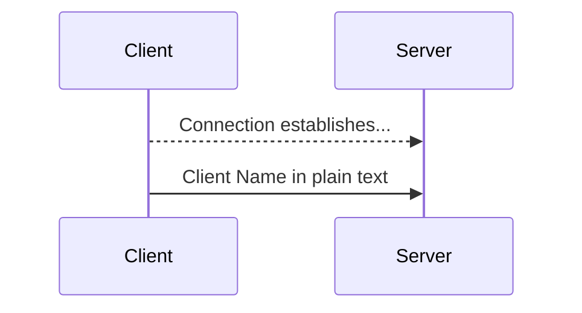
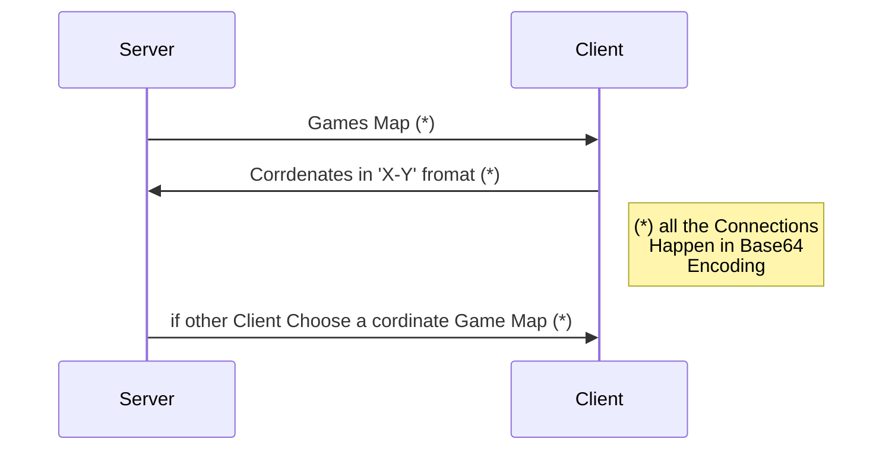

# Node Restful API wrapper
> a small package lets you interact with java server Via restful endpoints


you can use this package to run server then add your codes to interact with the java server of Data Structure Class Project available in [here](https://github.com/AshkanAbd/khat_noghte_rebuild)


## Installation

OS X & Linux & Windows:

```sh
npm install 
npm run
```
>it will startup an instance of server as well so no need to run it sepreted

>but its recommended to read the API docs and understand how server works

## Usage example

use this to give your app a way of simpler communication (restful API) or play with the server manually


# Connection Diagrams

### Connection Establishment Phase

### After Connection Established


## Map
    2-1
    0-0
    @-@A@-@-@
    -#-#-#-#-
    @-@-@-@-@
    -#-#-#-#-
    @-@-@-@-@
    -#-#-#-#-
    @-@-@-@-@
    -#-#B#-#-
    @-@-@-@-@

2-1  ==>  2:your Id , 1:opponent Id
0-0  ==> Results so far

| Symbol | Meaning |
|--|--|
| A | Client with the id 1 |
| B | Client with the Id 2 |
| @ | Nodes |
| # | Blocks as Points |
| - | the Line Can be Chosen |


 


